# Outlay — End-to-End Product Walkthrough & Audit

*Internal review doc. Generated for a founder product audit ahead of demo readiness.
Covers: what we've built, how it's architected, what the engine computes, and a
screen-by-screen customer flow for **each persona** (Finance and Engineering).*

> **Every screen below has an actual rendered screenshot** (captured from the live
> app with sample data), embedded inline under its heading. 27 screens in
> `docs/images/walkthrough/`.

> **Review round 1 — fixes applied (screenshots reflect these):**
> 1. **Billing trial badge** no longer contradicts itself — shows "Trial · starts at
>    setup" when not started, instead of a false "14d left" countdown.
> 2. **Banner fatigue** removed — the trial banner shows on Overview only (the sidebar
>    pill persists status elsewhere); pages no longer stack 2–3 banners.
> 3. **Sample dataset scaled to enterprise** — the worked demo is now a believable
>    ~$79k/quarter across 8 teams (was ~$1.5k), with a $79k-real-vs-$406k-naive "why
>    this number is right" callout. Regenerate via `python -m outlay.fixtures.gen_demo`.
> 4. **Estimate prices the connected backlog by default** — no JSON paste; the paste
>    box is now an optional "what-if." Demo tickets carry story points so estimates vary.
> 5. **Finance gets a demo-gated sample preview** so a finance-led demo isn't a dead end.

**Status of this audit:** A live end-to-end smoke test was run against the actual
app (FastAPI test client driving real routes). **54 of 55 checks passed**; the one
miss was a test-script omission (a Program requires at least one scope line — when
supplied, it works). Every screen renders, both persona flows behave correctly, all
exports and the machine API respond. Details in §10.

---

## Part 1 — What Outlay is (the one-paragraph version)

**Outlay puts AI compute on a budget.** It connects **read-only** to a company's
work tracker (GitHub Issues / Jira / Linear) and their AI-provider usage/billing
(Anthropic, Cursor, OpenAI/Azure, Bedrock, Vertex), and maps **every dollar of
LLM/coding-agent spend to the unit of work that drove it** — a ticket, an epic, a
team, a person. It then **forecasts the quarter**, **prices a planned backlog before
it's built**, **flags runaway tickets**, and lets finance **enforce a budget per
program**. It is **metadata-only and BYOK**: prompts, model outputs, and API keys
never leave the customer's environment — Outlay sees token counts, ticket IDs, task
categories, and dollar figures only.

**The moat:** existing FinOps/cloud-cost tools live at the infrastructure layer (API
keys, models, spans) and structurally cannot see the planning system. Outlay joins a
model call to a unit of *planned work*, with an explicit **fidelity tier** on every
dollar so the numbers reconcile to the provider invoice and finance can trust them.

> **Naming note:** the live brand is **Outlay / Outlay.ai**. The repo guide
> (`CLAUDE.md`) still calls the project "ModelPilot" — that's legacy. Same product.

---

## Part 2 — System architecture

The codebase is deliberately split so the customer-shippable part can be published
without exposing the vendor IP:

| Area | Path | Ships to customer? | Responsibility |
|---|---|---|---|
| **Engine** | `outlay/` | (vendor IP, runs server-side) | The attribution/forecast/pricing brain. Pure Python, stdlib only. |
| **Console** | `console/` | No (vendor-internal SaaS) | The FastAPI server-rendered web app: accounts, dashboards, billing, machine API. |
| **Thin client** | `modelpilot/` | **Yes** | Drop-in cost-routing gateway + commodity classifier. Customer's keys/prompts never leave their box. |
| **Brain** | `brain/` | No | Vendor-internal routing decision + entitlement. |
| **Ingest** | `ingest/` | No | Vendor-internal opt-in aggregate telemetry. |

**Tech:** FastAPI, server-rendered HTML (no SPA) built as Python f-strings in
`console/web.py`; routes in `console/server.py`; SQLite data layer in
`console/store.py`. The engine (`outlay/`) is imported by the console but never
imports back. Deployed on **Fly.io** (`modelpilot-console-prod`).

**Design system:** Inter typeface; forest-green accent (`--grn #0f6b4f`); white/paper
cards with subtle borders; a dark navy top bar on public pages; a left sidebar in the
app. Motion: staggered reveal animations, an NProgress-style nav bar, in-house
zero-dependency contextual coachmarks (a privacy feature — no third-party script).
Built to **WCAG 2.1 AA**.

---

## Part 3 — What the engine computes (the IP)

The pipeline, in order:

1. **Ingest** — usage events (per-call LLM telemetry with **split token counts**:
   uncached input, output, cache-read, cache-write) + work items (tickets).
2. **Cost normalization** (`pricing.py`) — the load-bearing step. Each token class is
   priced separately: **cache reads bill at ~0.1×, cache writes at ~1.25×** of base
   input. Collapsing token counts (what naive trackers do) **inflates cache-heavy
   workloads 1.5–10×**. This is the single biggest accuracy moat.
3. **Join** (`join.py`, `attribute.py`) — map each event to a ticket with a
   **fidelity tier**, best to worst:
   - **CALL** — explicit ticket tag at call time
   - **BRANCH** — git branch parsed/resolved to a ticket (e.g. `fix/GH-123-crash`)
   - **SESSION** — a coding-agent session that resolves to exactly one ticket lends
     that ticket to its untagged events (one tier below BRANCH — honest)
   - **TEAM** — only key→user→team known, no ticket
   - **INVOICE** — raw provider event only
   Unattributable spend still shows with its tier, so totals **reconcile to invoice**.
4. **Classify** (`classify.py`) — each ticket → BUGFIX / FEATURE / REFACTOR / TEST /
   CHORE / UNKNOWN, via labels → title/body keywords → branch verbs → diff-size.
5. **Learn** (`forecast.py`, `size.py`) — per-class cost distribution (mean, median,
   p10, p90) from closed tickets; fit size models (cost-per-story-point or
   cost-per-diff-line) only where the correlation actually exists.
6. **Forecast** (`forecast.py`) — bottom-up cost of open roadmap, with a
   **variance-pooled** aggregate band (tighter than naively summing p90s, because
   per-item errors partially cancel — and always nested inside the fully-correlated
   envelope so it can't over-claim).
7. **Calibrate** (`backtest.py`) — **leave-one-out** cross-validation on the
   customer's *own* realized spend. Reports **MdAPE** ("half of tickets land within
   X% of estimate"), bias, and p90 coverage. Skips thin classes rather than guessing.
8. **Detect anomalies** (`forecast.py`) — flag tickets ≥ **3× their class median**
   (threshold tunable). Guardrails bind on outliers, not on every task.
9. **Recommend** (`recommend.py`) — per-class model routing (route-down to a cheaper
   tier). Unvalidated downgrades carry a **35% rework penalty** and a
   "needs validation" flag — no capability loss claimed without proof.
10. **Prove** (`proof.py`) — `cost_fidelity` shows Outlay's cache-aware number vs the
    naive token-count number, with the inflation factor and cache-read share — the
    "why you can trust this" artifact.

**Supported sources** (fidelity ceiling in parens): Claude Code (BRANCH), Anthropic
per-call (BRANCH), Anthropic Admin API (TEAM), Cursor (TEAM), OpenAI/Azure (TEAM),
Bedrock (TEAM), Vertex (TEAM); trackers: GitHub Issues, Jira, Linear. PR closing-refs
("Closes #123") recover branch→ticket links automatically.

---

## Part 4 — The two personas

A company's **first** user is either a **Finance leader** or an **Engineering
leader**. The very first screen after sign-in is a **mandatory role gate**. The role
chosen drives the *entire* experience — not just nav order, but which capabilities and
setup surfaces appear. When a user is **invited** by their counterpart, their role is
already known from the invite, so they **skip the gate**.

| | **Finance** (consumes spend after the fact) | **Engineering** (does all the setup) |
|---|---|---|
| Mental model | Govern & allocate the bill | Operate & ship efficiently |
| Nav: Analyze | Spend · Budgets · Programs | Spend · Accuracy · Estimate · Budgets |
| Nav: Sources | **none** (no setup) | Connect · API |
| Onboarding | Invite engineering counterpart only | Upload direct reports + connect sources |
| Headline KPIs | Spend · Forecast · **Allocated to teams** · Open work | Spend · **Mapped to a ticket** · **Runaway tickets** · Forecast |
| Empty state | "Dashboard on its way" + invite engineering | "Connect your sources" CTA + connect form |

**Key principle (recently enforced):** *Finance does no setup.* All connecting,
mapping, and reconciling is engineering's job. Finance only consumes dashboards.

---

## Part 5 — FINANCE persona: screen-by-screen flow

### F0 · Landing → Sign up

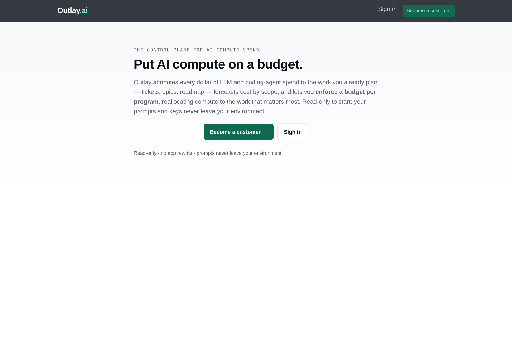
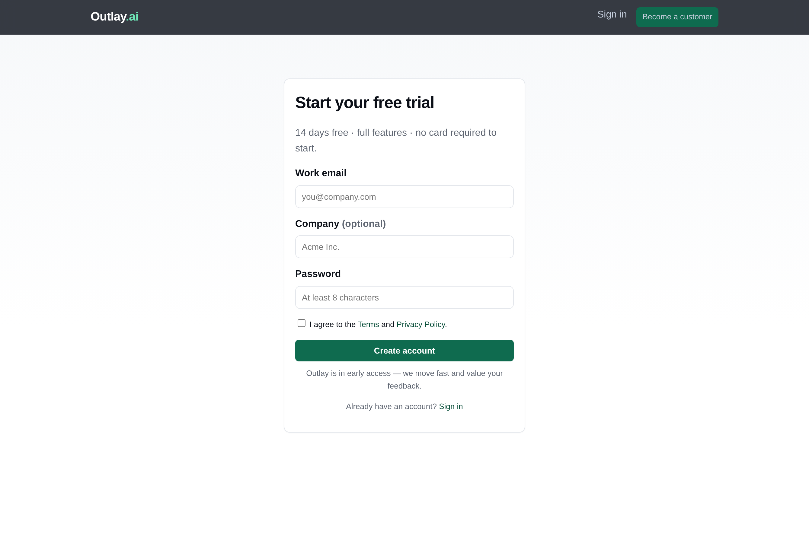
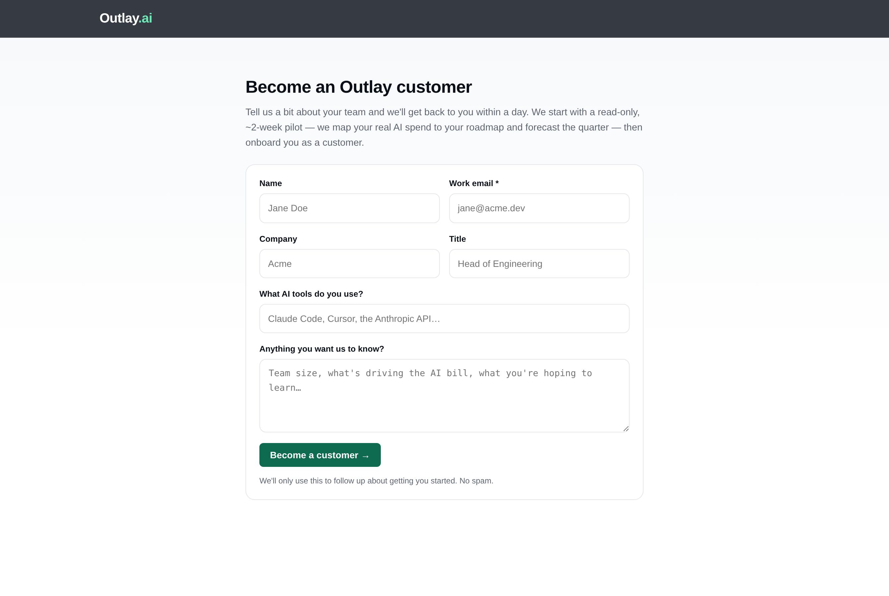

- **Landing (`/`)** — H1 **"Put AI compute on a budget."** Eyebrow "The control plane
  for AI compute spend." Value prop + "Read-only to start; your prompts and keys never
  leave your environment." CTAs: **Become a customer →** (`/pilot-request`) · **Sign in**.
- **Sign up (`/signup`)** — H1 **"Start your free trial."** "14 days free · full
  features · no card required to start." Fields: work email, company (optional),
  password, terms consent. → **Create account**.

### F1 · The role gate (`/app/welcome`, first screen)

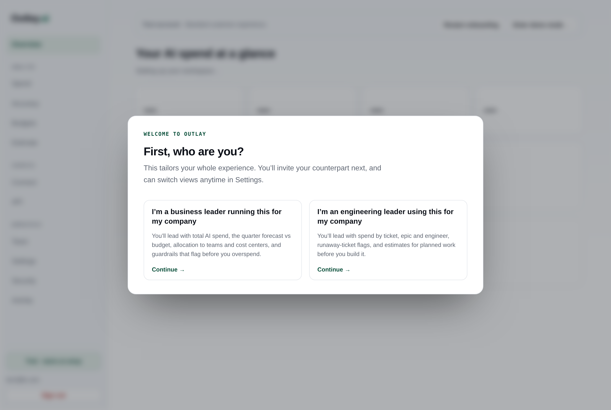

A **full-screen centered takeover** over a blurred dashboard skeleton — undismissable;
the new customer cannot proceed until they pick a role.
- H1 **"First, who are you?"**
- Two tiles: **"I'm a finance leader setting this up for my business"** /
  **"I'm an engineering leader using this for my business."**
- Finance picks the finance tile → persona set → advances to F2.

### F2 · Finance onboarding (Step 2)

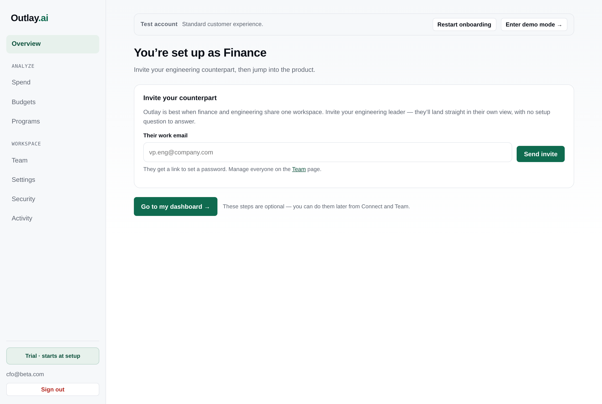

- H1 **"You're set up as Finance."**
- Copy: "Invite your engineering counterpart, then jump into the product."
- One card: **"Invite your counterpart"** — enter the engineering leader's work email;
  they land straight in their own engineering view with no role question.
- **No org upload, no connect form** — finance does no setup.
- **"Go to my dashboard →"** (these steps are optional).

### F3 · Finance overview — *empty state* (`/app`, before data)

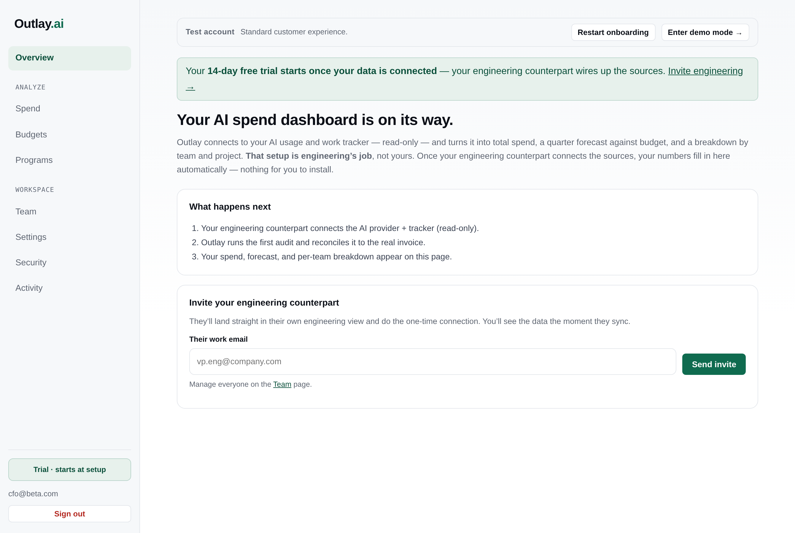

This is what finance sees until engineering has connected the sources:
- H1 **"Your AI spend dashboard is on its way."**
- Body: explains Outlay turns AI usage + tracker into spend/forecast/breakdown, and
  that **"that setup is engineering's job, not yours."**
- Card **"What happens next"** — a 3-step explainer (engineering connects → first
  audit reconciles → your numbers appear here automatically).
- Card **"Invite your engineering counterpart"** — one-click invite (role + persona
  pre-set so they skip the gate).
- **"See it with sample data →"** — a demo-gated preview (founder/demo accounts only)
  so a finance prospect can be walked through the real dashboard instead of an empty
  room. Regular finance users don't see it (sample data is demo-only by design).
- **Nav has no Sources group** — only **Analyze** (Spend · Budgets · Programs) and
  **Workspace**.
- Trial pill reads "Trial · starts at setup" and points at *Invite engineering*, not a
  connect form. (The full trial banner shows on Overview only — the sidebar pill
  persists status elsewhere, so it's no longer repeated on every page.)

### F4 · Finance overview — *with data* (`/app`)

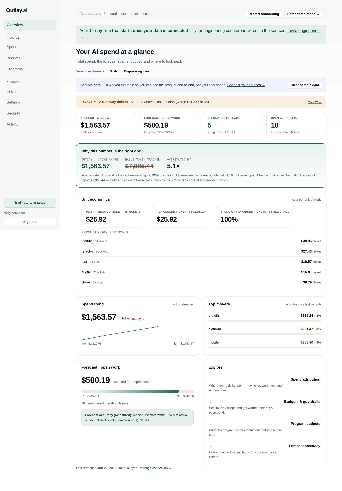

Once engineering connects and the first sync lands (a 90-day backfill):
- H1 **"Your AI spend at a glance."**
- **Four KPIs (clickable drill-downs):** *AI spend · window* · *Forecast · open work*
  · **Allocated to teams** (top cost-center) · *Open work items*.
- **"Why this number is the right one"** — the cost-fidelity callout (cache-aware vs
  naive, with the inflation factor) — the trust artifact.
- **Unit economics** — cost per attributed ticket, per closed ticket, % spend on
  reworked tickets, priciest work-types per ticket.
- **Spend trend** + **Top movers** (once there are ≥2 syncs to compare).
- **Forecast · open work** — expected spend from open scope with a p10–p90 band.
- **Explore** — role-ordered jump-offs (Spend, Budgets, Programs, Accuracy).

### F5 · Spend (`/app/outlay`)

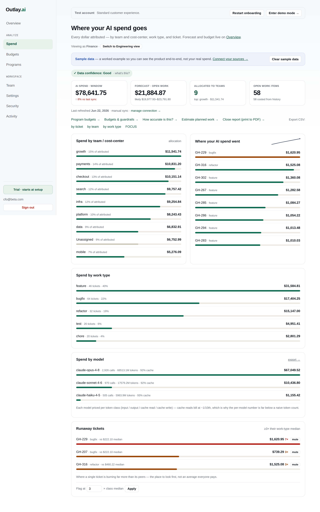

- H1 **"Where your AI spend goes."**
- Finance-first sections: **Spend by team / cost-center** (the chargeback view) →
  **Where your AI spend went** (by ticket) → **Spend by work type** → **Spend by
  model** → **Runaway tickets**.
- Each row drills into a **scope page** (the tickets behind that team/work-type).
- Export bar: CSV by ticket / by team / by work type, plus **FOCUS** (FinOps Open
  Cost & Usage Spec) export for any BI tool, and a **Close report** (print-to-PDF).
- The engineering-only "lift your coverage" diagnostic is **hidden** for finance.

### F6 · Budgets & guardrails (`/app/outlay/budgets`)

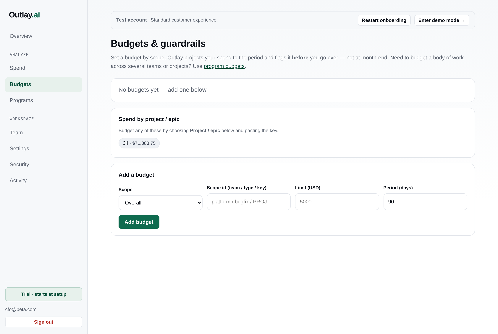

- H1 **"Budgets & guardrails."**
- **Spend by project / epic** with live status, and **"Add a budget"** — set a limit
  by scope (overall / team / work-type / project) and period; pace projection flags
  *over / warn / ok* **before** you overspend.

### F7 · Program budgets (`/app/outlay/programs`)

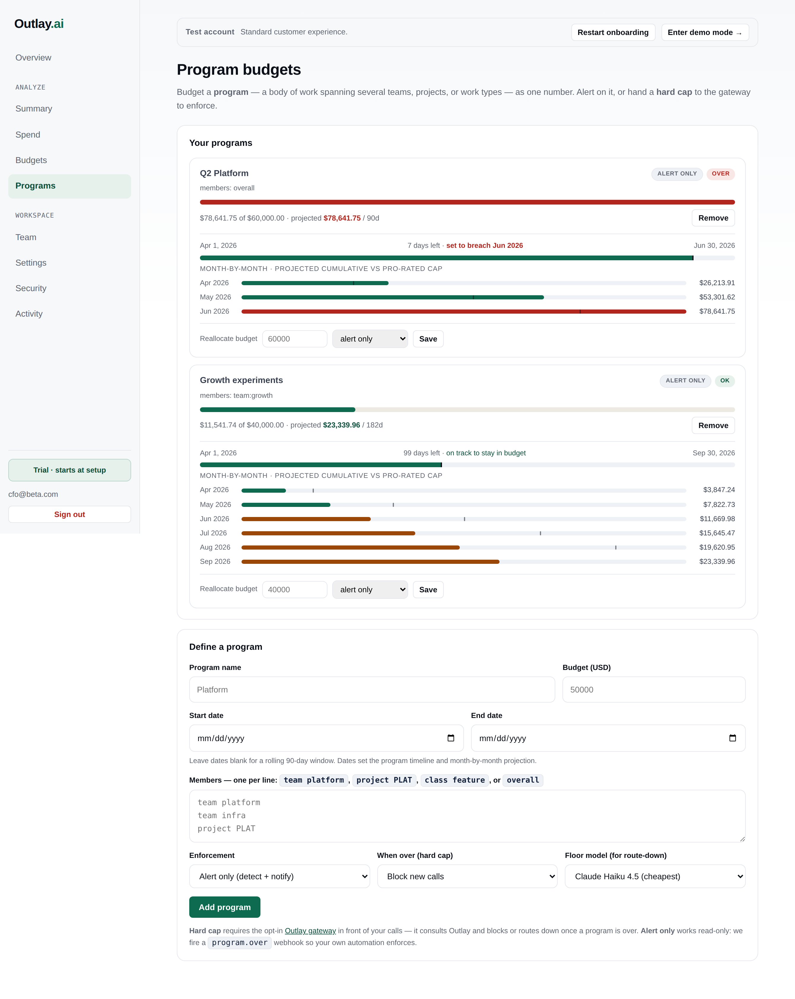

- H1 **"Program budgets."**
- **"Define a program"** — budget a program across multiple scopes (teams/classes),
  set a hard cap and period, choose an **enforcement mode** (alert vs enforce), an
  action (block), and an optional **floor model** (route-down ladder). This is the
  governance teeth: a program cap enforced across teams, surfaced to the machine API
  (`/api/v1/enforcement`) the gateway consults.

### F8 · Drill-down / scope (`/app/outlay/scope`)

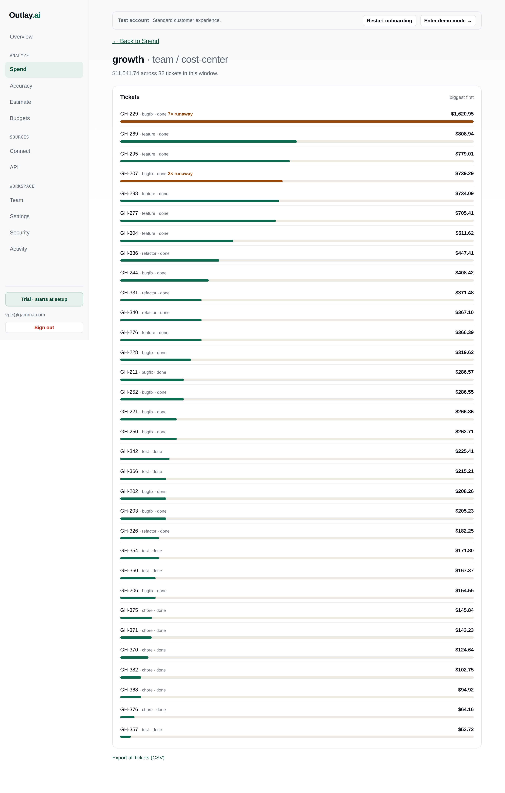

- Reached by clicking any team or work-type row. H1 e.g. **"growth · team /
  cost-center"** — the tickets behind that scope, biggest first, with runaway outliers
  flagged. Back link to Spend.

### F9 · Close report (`/app/outlay/close-report.html`)

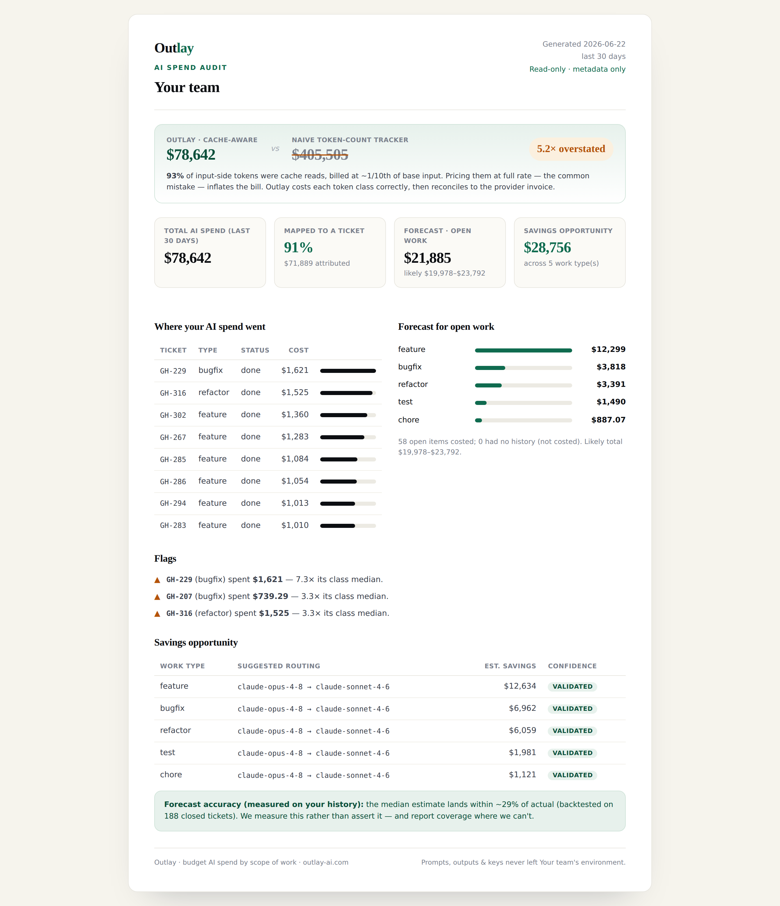

- A printable, standalone **AI spend audit readout** (the VP/board read-in) — total
  spend, attribution, by-team allocation, period — opens in a new tab, print-to-PDF.

*(Workspace screens — Settings, Security, Team, Billing, Activity — are shared; see §7.
Finance does not see Connect or API.)*

---

## Part 6 — ENGINEERING persona: screen-by-screen flow

### E1 · Role gate
*(Same takeover as F1 — see image above.)* Engineering picks **"I'm an engineering leader…"** → persona set.

### E2 · Engineering onboarding (Step 2)

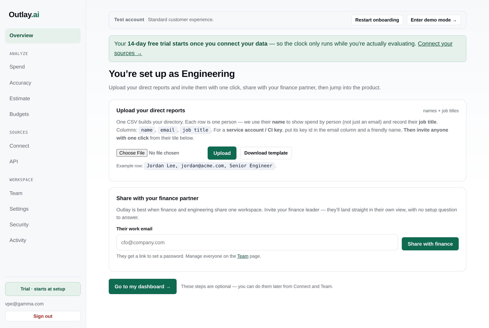

- H1 **"You're set up as Engineering."**
- **"Upload your direct reports"** — CSV (`name, email, job title`) building the
  identity directory; powers usage-by-person and one-click invites. Each person renders
  as a **tile** with an **Invite** button; bulk **"Invite all N not yet invited."**
- **"Share with your finance partner"** — invite the finance counterpart (no
  invite-another-engineer option).
- **"Go to my dashboard →"**

### E3 · Engineering overview — *empty state* (`/app`, before data)

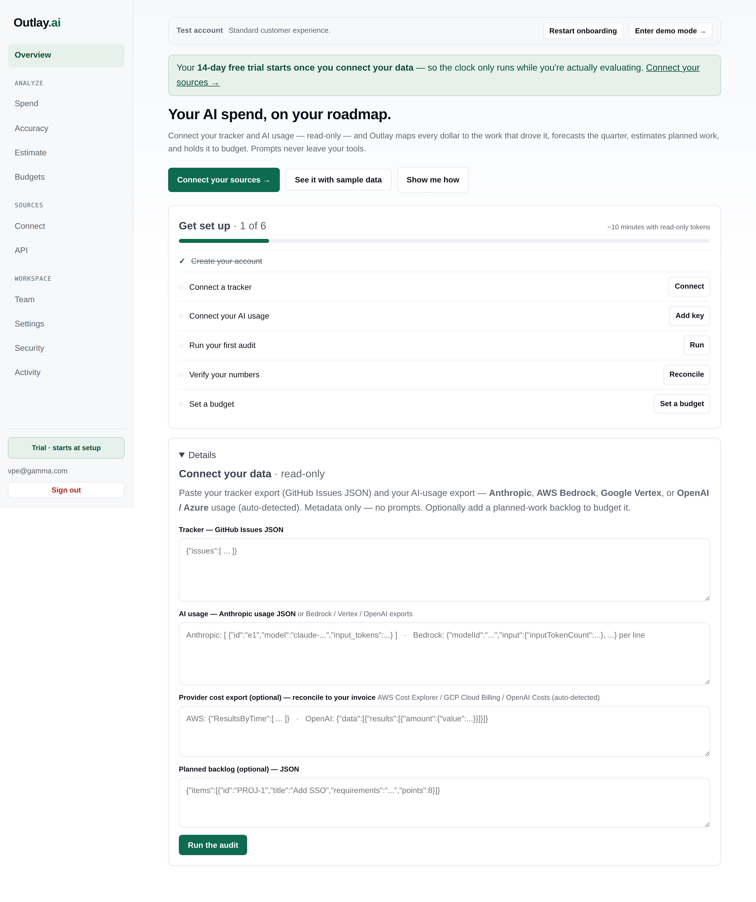

- H1 **"Your AI spend, on your roadmap."**
- CTA row: **Connect your sources →** · **See it with sample data** (demo accounts
  only) · **Show me how** (launches the contextual connect walkthrough).
- **Setup checklist** (endowed-progress): Create account ✓ → Connect a tracker →
  Connect AI usage → Run first audit → Verify your numbers → Set a budget.
- **Nav has the Sources group** (Connect · API) plus Analyze and Workspace.

### E4 · Connect your sources (`/app/outlay/connect`)

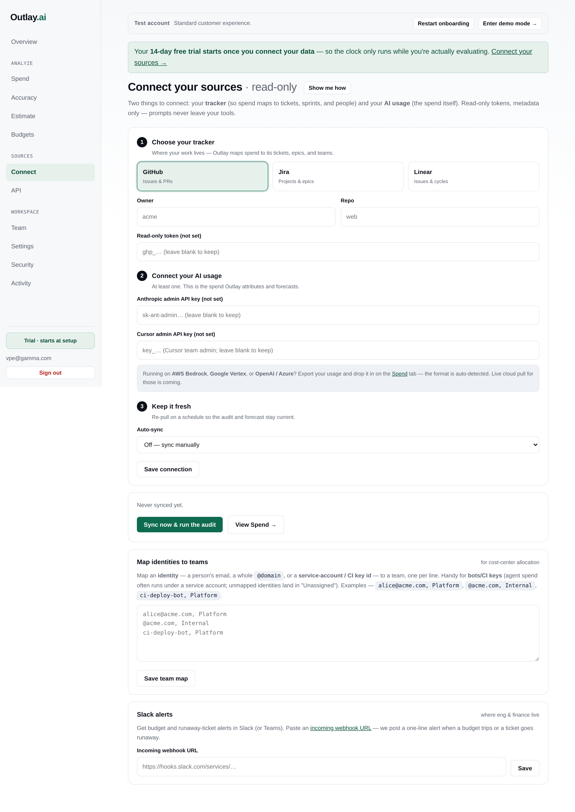

- H1 **"Connect your sources · read-only"** with a **"Show me how"** guided tour.
- **Tracker** — GitHub Issues / Jira / Linear (owner+repo+token, or base+email+token,
  or API key). **AI usage** — Anthropic admin key and/or Cursor key (BYOK, read-only).
- **Map identities to teams** — paste or upload `id → team` (and names/titles); the
  engine's IdentityGraph resolves key→user→team for cost-center allocation.
- **Slack alerts** — optional webhook for budget/anomaly notifications.
- **Auto-sync** interval; the first sync **backfills a 90-day rolling quarter** so the
  dashboard is rich on day one.

### E5 · Engineering overview — *with data* (`/app`)

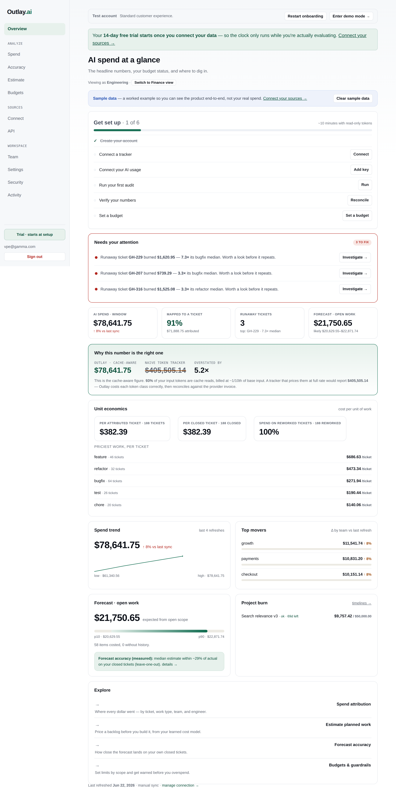

- H1 **"AI spend at a glance."**
- **Four KPIs (eng-specific):** *AI spend · window* · **Mapped to a ticket** (coverage
  %, the trust metric) · **Runaway tickets** (count, top offender) · *Forecast · open
  work*.
- Same trust callout, unit economics, trend/movers, forecast, and Explore as finance,
  but ordered for shipping (Spend, Estimate, Accuracy, Budgets).

### E6 · Spend (`/app/outlay`)

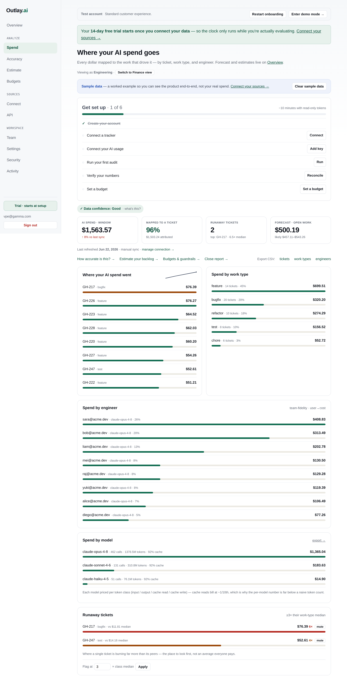

- H1 **"Where your AI spend goes."**
- Eng-first sections: **Where your AI spend went** (by ticket) → **Spend by work type**
  → **Spend by engineer** → **Spend by model** → **Runaway tickets**.
- Includes the **coverage-lift diagnostic** (where attribution is leaking + the
  no-effort fix: connect PRs / map teams) — engineering-only.

### E7 · Accuracy (`/app/outlay/accuracy`)

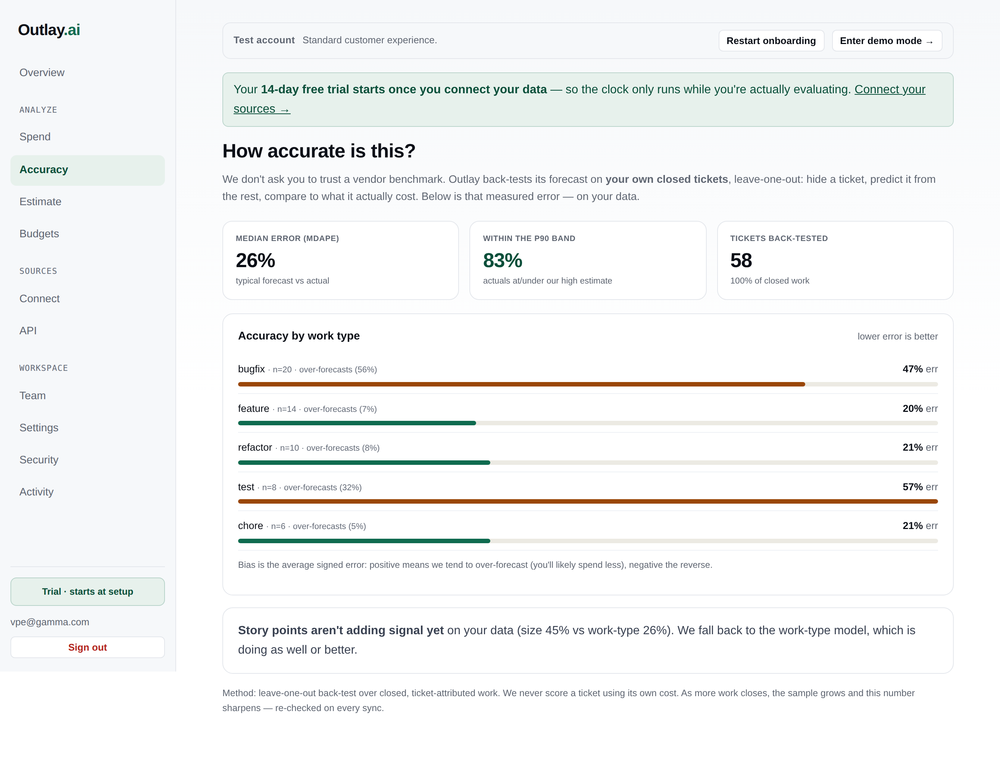

- H1 **"How accurate is this?"**
- KPIs: **Median error (MdAPE)** · **Within the p90 band** · **Tickets back-tested** —
  the leave-one-out calibration on the team's own closed tickets, plus **Accuracy by
  work type**. This is what makes the forecast credible.

### E8 · Estimate your backlog (`/app/outlay/estimate`)

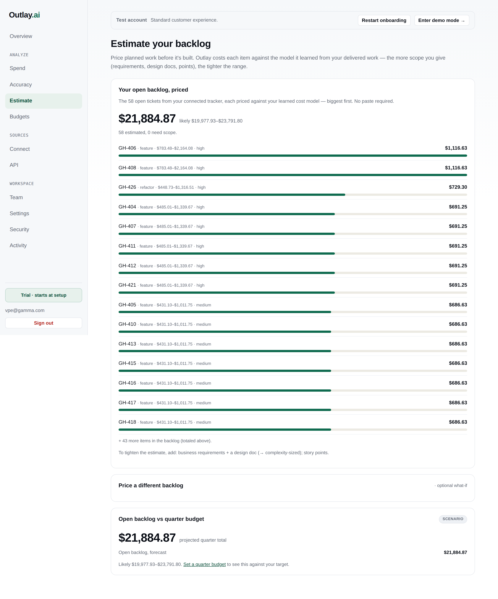

- H1 **"Estimate your backlog."**
- **Leads with "Your open backlog, priced"** — the open tickets from the *connected*
  tracker, each priced against the learned cost model, biggest first (no JSON paste
  required). Per-item confidence tiers: high = has points + fitted size model; medium =
  class history; low = thin. The list caps to the top 15 with a "+N more" note.
- **"Price a different backlog"** — a collapsed, optional what-if box: paste a JSON
  plan to model work you haven't filed yet. When used, the scenario card adds it *on
  top of* the open-work forecast.
- **"Open backlog vs quarter budget" / "If you commit this backlog"** — projection vs a
  set budget (variance-pooled band). The connected-backlog view shows the backlog total
  alone (it *is* the open work — no double-count); the what-if view shows forecast + plan.

### E9 · Budgets (`/app/outlay/budgets`)
Same as F6 — engineering sets/uses budgets too.

### E10 · Drill-down / scope

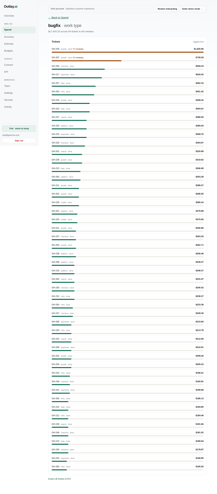

Same as F8 — e.g. H1 **"bugfix · work type."**

*(Engineering also has full access to the API & data-export page — see §7.)*

---

## Part 7 — Shared Workspace screens (both personas)

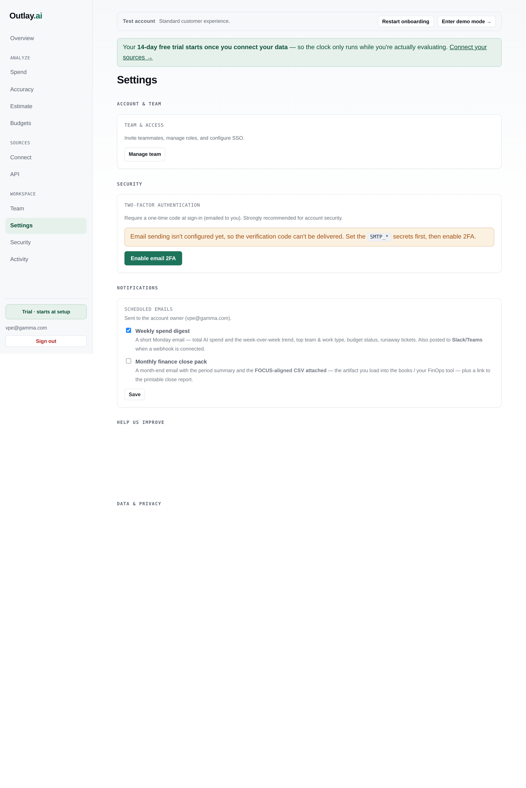
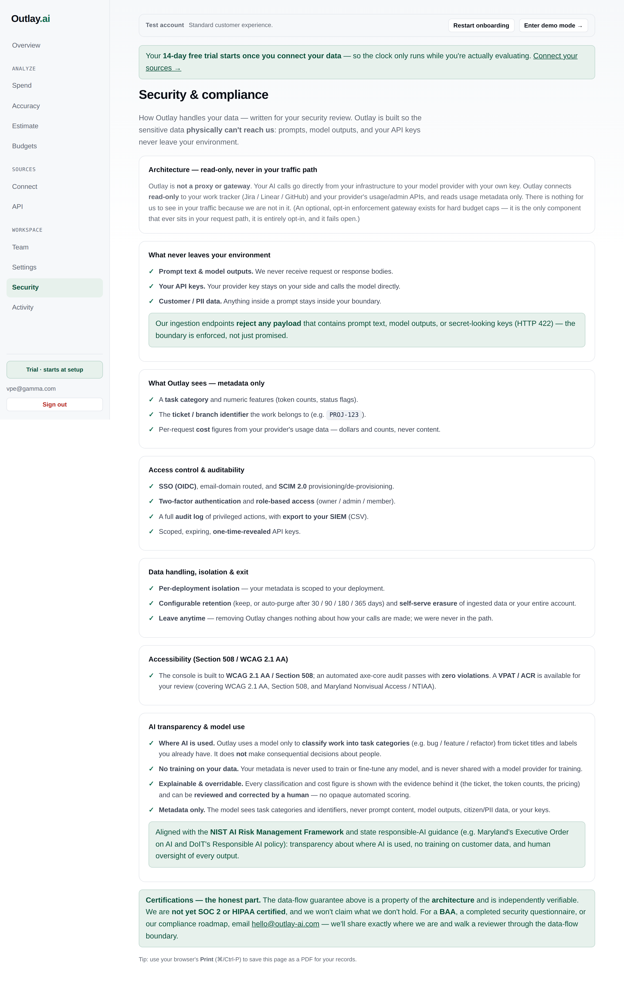
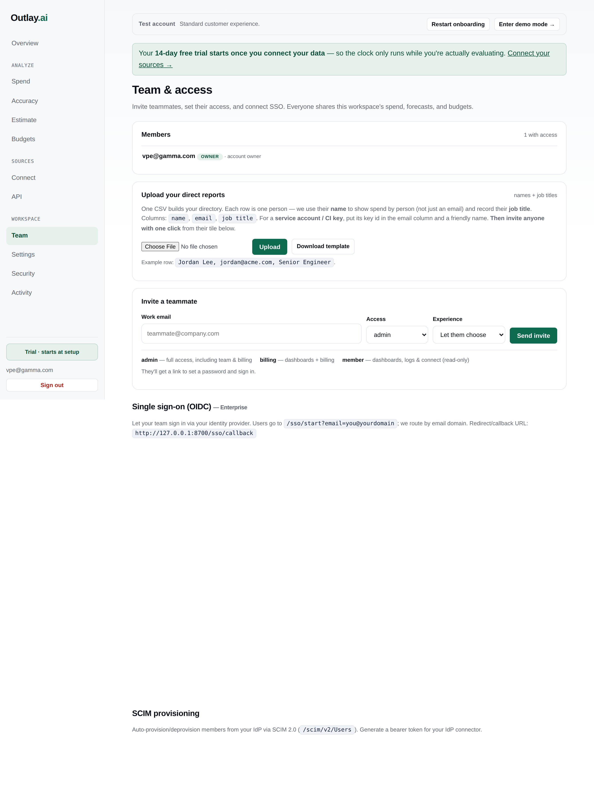
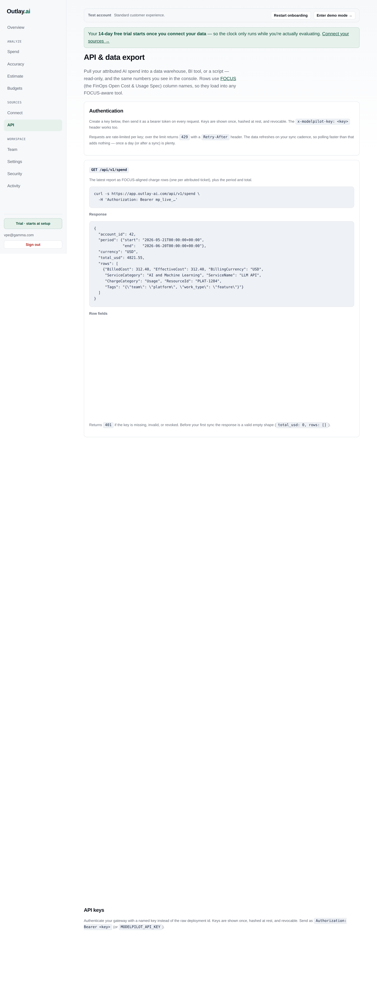
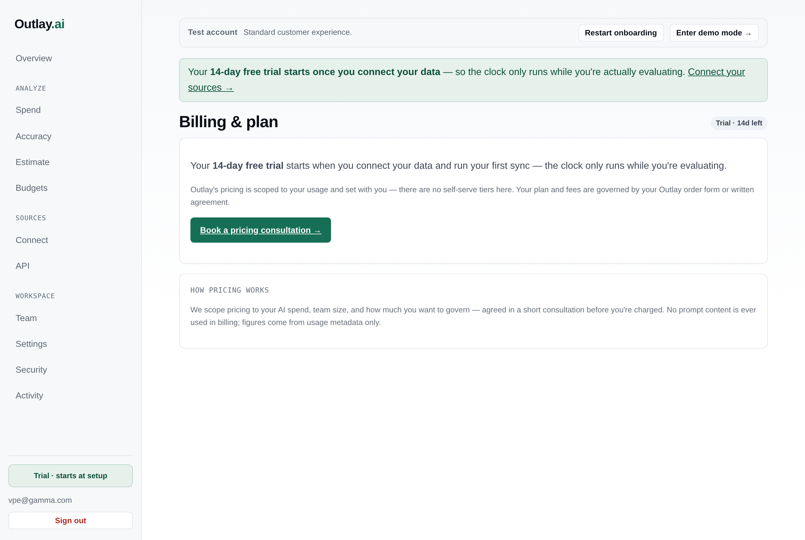
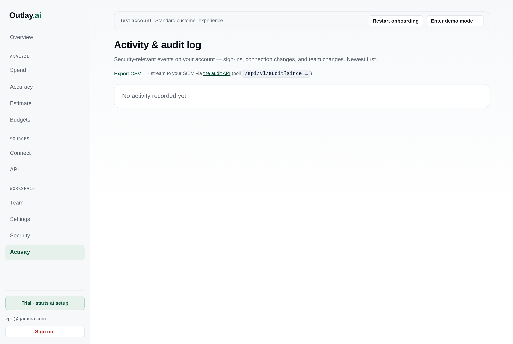

- **Settings (`/app/settings`)** — H1 **"Settings."** Account/workspace prefs,
  persona switch, retention controls, feedback.
- **Security & compliance (`/app/security`)** — H1 **"Security & compliance."** The
  trust page, and a genuine differentiator. Sections: *Architecture — read-only, never
  in your traffic path* · *What never leaves your environment* (prompts, outputs, keys)
  · *What Outlay sees — metadata only* · *Access control & auditability* (SSO/OIDC,
  SCIM, 2FA, RBAC, audit log with SIEM export) · *Data handling, isolation & exit* ·
  *Accessibility (Section 508 / WCAG 2.1 AA)* · *AI transparency & model use.*
- **Team & access (`/app/team`)** — H1 **"Team & access."** Members + roles; the same
  **direct-reports upload** and tile-based **invite a teammate** flow; role changes and
  removal. Owner/admin only.
- **API & data export (`/app/api`)** — H1 **"API & data export."** Machine API keys,
  the audit API (`/api/v1/spend`, `/api/v1/enforcement`, `/api/v1/audit`), webhooks,
  CSV/FOCUS exports. (Engineering only — it's a setup surface.)
- **Billing & plan (`/app/billing`)** — H1 **"Billing & plan."** Trial status (14 days,
  **starts at setup completion**, not signup), plan conversion (Stripe).
- **Activity & audit log (`/app/audit`)** — H1 **"Activity & audit log."** Every
  sensitive action, with CSV export. Owner/admin only.
- **Account security extras** — 2FA enroll/confirm/disable, account deletion
  (self-serve erasure), password reset.

---

## Part 8 — Vendor-internal & machine surfaces (not customer-facing)

- **Admin console (`/admin`, `/admin/leads`, `/admin/health`, `/admin/proposals`,
  `/admin/accounts/{id}`)** — founder/staff view: pilot-request inbox, account
  management, savings proposals, cron/run health.
- **Demo mode** — gated to `DEMO_ACCOUNT_EMAILS` (supports `*`, exact emails, and
  whole `@domain`). Lets the founder run a full end-to-end demo (finance then
  engineering) with sample data, a demo talk-track (`/app/demo/guide`), toggle between
  standard and demo experience, and a **"Restart onboarding"** button to re-test the
  first-run flow. "See it with sample data" appears only in demo mode.
- **Machine API** — `/api/v1/spend`, `/api/v1/data-quality`, `/api/v1/enforcement`
  (+ `/report`), `/api/v1/audit`; entitlement/meter/proposals/logs/policy endpoints
  the gateway and brain consult; Stripe webhook; SSO start/callback; SCIM Users.
- **Ops** — `/status` (public, "fails open"), `/api/health`, `/healthz`, cron-driven
  `sync-due` and `digest-due`.

---

## Part 9 — The cost-routing gateway (shipped thin client)

`modelpilot/` is the only customer-published component: a **drop-in gateway** in front
of Claude API calls that consults Outlay's policy/enforcement and can **route a request
down to the cheapest model that's provably good enough** (commodity classifier runs
**on the customer's box** — keys and prompts never leave). Billed at **20% of realized
savings**. It **fails open**: if Outlay is unreachable, traffic passes straight through
to the Claude API, unrouted.

---

## Part 10 — Smoke-test results (this audit)

Live run against the real app (every route exercised through the FastAPI test client):

**Passed (54):** landing, signup, login, pilot-request, forgot, status pages render ·
signup → **role gate** redirect works · both role tiles present · **finance**: welcome
(no org upload), empty "dashboard on its way" + invite-engineering, **no Sources nav**,
spend/budgets/programs/close-report all render with sample data · **engineering**:
welcome (upload direct reports + job title + share-with-finance), connect CTA, **has
Sources nav**, connect page, overview/spend/accuracy/estimate/budgets render ·
drill-down scope by class and by team · budget create persists · anomaly mute +
threshold persist · CSV exports (tickets/teams/classes/people) + FOCUS export ·
settings/security/team/api/billing/audit render · **invited counterpart gets persona
pre-set** (skips gate) · `/api/health` + `/healthz`.

**The one miss (now explained):** "program created" — my script omitted the required
scope line; a Program needs ≥1 member scope. Re-run **with** a scope: program creates
and shows correctly, and `/api/v1/enforcement` responds (401 without an API key — the
machine API requires a key, not a session cookie; correct behavior).

**Verdict:** the product is functionally whole end-to-end across both personas. No
broken screens, no dead flows.

---

## Appendix — full route map

**Public/auth:** `/` · `/signup` · `/login` · `/login/verify` (+ resend) · `/logout` ·
`/forgot` · `/reset` · `/pilot-request` (+ `/thanks`) · `/status`.
**App (first-run):** `/app/welcome` (role gate) · `/app/persona`.
**App (dashboards):** `/app` · `/app/outlay` · `/app/outlay/scope` ·
`/app/outlay/accuracy` · `/app/outlay/estimate` (+ `/run`) · `/app/outlay/budgets`
(+ delete) · `/app/outlay/programs` (+ update/delete) · `/app/outlay/close-report.html`.
**App (sources, eng-only):** `/app/outlay/connect` · `/app/outlay/identity` (+ upload) ·
`/app/outlay/sync` · `/app/outlay/run` · `/app/api` · webhooks · keys · deployments.
**App (workspace):** `/app/settings` · `/app/security` · `/app/team` (+ invite / roster
/ invite-all / role / remove) · `/app/billing` (+ convert) · `/app/audit` · 2FA ·
account delete · feedback · mode/autopilot.
**Demo:** `/app/demo/enter` · `/app/demo/exit` · `/app/onboarding/reset` ·
`/app/demo/guide` · `/app/outlay/sample` · `/app/outlay/clear`.
**Machine/API:** `/api/v1/spend` · `/api/v1/data-quality` · `/api/v1/enforcement`
(+ report) · `/api/v1/audit` · `/api/entitlement` · `/api/meter` · `/api/proposals` ·
`/api/logs` · `/api/policy` · `/api/stripe/webhook` · `/api/health` · `/healthz`.
**SSO/SCIM:** `/sso/start` · `/sso/callback` · `/scim/v2/Users` · `/app/sso` (+ scim).
**Admin:** `/admin` · `/admin/leads` · `/admin/proposals` · `/admin/health` ·
`/admin/accounts/{id}` (+ proposal/action).
**Internal cron:** `/internal/outlay/sync-due` · `/internal/outlay/digest-due`.
